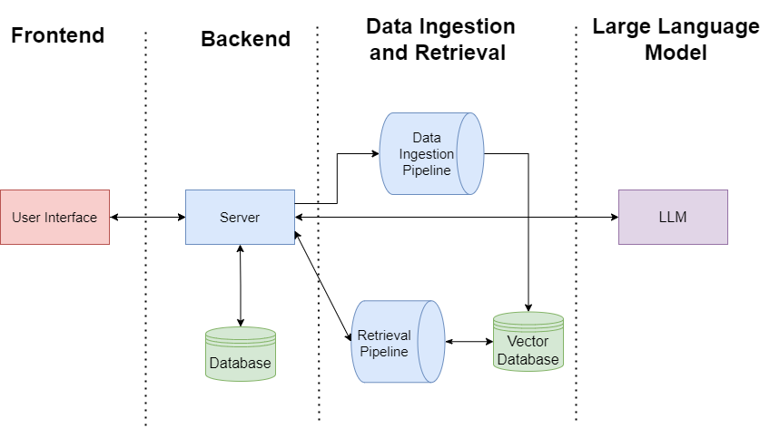

# LLM-Course-QA
This project is a question-answering system that leverages Large Language Models (LLMs) to provide a platform for higher-education students to receive answers to course specific questions. The system uses information in course documents uploaded by instructors as its sources when responding to these queries. 
# High Level Architecture
This project is split into 4 main systems: frontend, backend, data ingestion and retrieval pipelines, and the large language model. 

The diagram below shows the resources used to deploy the application. For an in-depth description of our system architecture see the [High Level Architecture](./docs/HighLevelArchitecture.md)

# Deployment Guide
To learn how to deploy the application on AWS, see the [Deployment Guide](./docs/DeploymentGuide.md)
# User guide
To learn how to use the application, see the [User Guide](./docs/UserGuide.md)

# Pricing Estimate

# Post-proof of concept considerations

