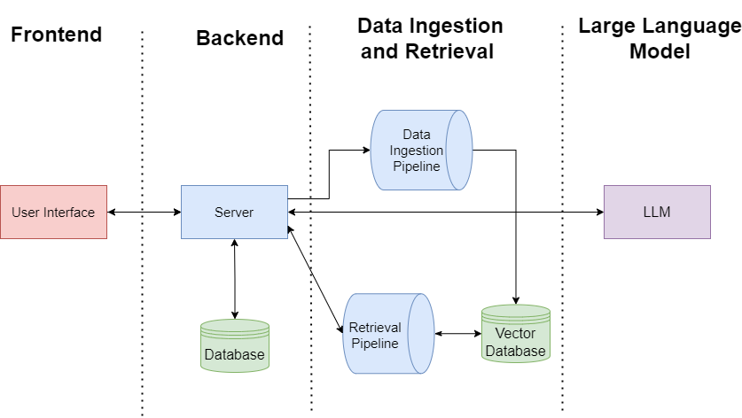
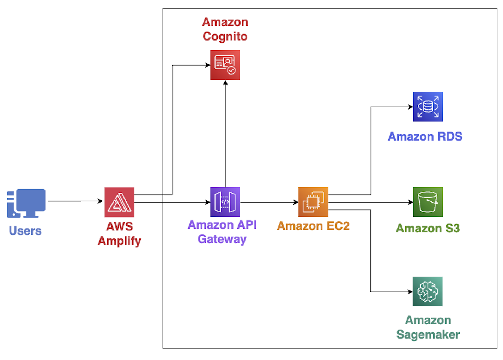

# High Level Architecture

## Table of Contents

-   [High Level Architecture](#high-level-architecture)
    -   [Table of Contents](#table-of-contents)
    -   [Introduction](#introduction)
    -   [System Overview](#system-overview)
        -   [Frontend](#frontend)
        -   [Backend](#backend)
        -   [Data Ingestion and Retrieval Pipelines](#data-ingestion-and-retrieval-pipelines)
        -   [Large Language Model](#large-language-model)
        -   [Cloud Architecture](#cloud-architecture)

## Introduction

LLM-Course-QA is a platform that provides a centralized hub for higher-education students to pose queries and receive answers in a timely manner. This is done by using course documents, uploaded by the instructors, to provide answers to the student queries.

After an instructor uploads a course document, it processes the content and stores it in a vector database for retrieval. When a student asks a question, the system uses a process called retrieval augmented generation (RAG), whereby it fetches the most relevant documents to the question. The relevant documents are then given to the large language model to generate the answer for the student.


## System Overview

This section will describe the 4 main systems in our project: the frontend, backend, data ingestion and retrieval pipelines, and the large language model (LLM).





### Frontend

The frontend is the user interface which users interact with for authentication, managing courses, managing course content, asking course-specific questions, etc. The layout of the frontend is structured to provide a role-specific user experience for students, instructors, and admins. They each view their own user interface, upon being authenticated, which allows them to perform their role specific actions. For more information on these actions, see the [User Guide](./UserGuide.md).


### Backend

The backend hosts the application programming interface (API) endpoints which acts as an intermediary between the frontend, database, data ingestion and retrieval system, and the large language model. The backend of our application follows a layered architecture, composed of a web layer, business logic layer, and a data layer.


The web layer is responsible for allowing the frontend to communicate with the backend through API requests. Upon receiving a request, the web layer validates that the received data is in the correct format and sends this data down to the business logic layer to be further processed.

The business logic layer is responsible for the core functionality of our application. It acts as a channel between the web layer and the data layer. Upon receiving the request data from the web layer, the business logic layer processes the data according to the specific module functionality. Upon completing the request, the result is passed back up to the web layer to be returned to the frontend.

The data layer is responsible for all data access functionality. This layer consists of the user, course, query and document models which represent the tables in the database. The data layer exposes methods for the business logic layer to perform Create, Read, Update, and Delete (CRUD) operations on the database tables. For the database schema, please see [Database Schema](./DatabaseSchema.md).


### Data Ingestion and Retrieval Pipelines

The data ingestion and retrieval pipelines are responsible for intaking course documents from instructors, vectorizing the input, and storing them in the Chroma vector database for retrieval through student queries. The system has two main processes: data ingestion and retrieval augmented generation (RAG).

The purpose of the data ingestion pipeline is to extract, process, and store the content present in documents that instructors upload to a course in order to facilitate the RAG process. The data extraction process takes the uploaded course documents and converts them to plain text using optical character recognition (OCR). After extracting the documents into plain text, it is converted into vectors (a mathematical representation of the text) using an embedding model. The vectorized document along with the source document metadata is uploaded to a vector database to be later retrieved by the RAG process.


The RAG pipeline implements the RAG process which, based on the student query, retrieves course information that is similar and generates a response using that context.


The vectorizing stage takes in the student query and vectorizes it using the same embedding model as the text processing stage.

In the retrieval stage, we take the user query vector and search for the most similar documents in the database using cosine similarity. The four most similar documents retrieved, along with the query, are fed into the generation stage

In the generation stage, the relevant documents retrieved are used as context, in combination with the user’s query, to produce a new prompt for our LLM. The prompt is built using a template to be formatted as an input for the LLM for it to generate an answer for the query. 


### Large Language Model

The large language model (LLM) serves as the final system in generating an answer to a student query. It takes in the prompt from the RAG process and produces an answer to the student query using the most relevant course documents uploaded by the instructor. The prompt format used to get responses from the LLM is as follows:
```
<s>[INST] 
You are a helpful assistant that provides direct and concise answers based only on the provided information.
Use the following information from the course information to answer the user's question. If the answer is not present in the provided information, your answer must only be 'I do not know the answer'.
Do not refer to the fact that there are provided course documents in your answer, just directly answer the question. 
< -- COURSE INFORMATION -- >
{context}
< -- END COURSE INFORMATION -- >
< -- QUESTION -- > 
{question}
< -- END QUESTION -- >
Solution:
[/INST]
```

### Cloud Architecture

The frontend of the application is hosted on AWS Amplify. The frontend then connects to an Amazon API Gateway which is a proxy to the backend hosted on an Amazon EC2 instance. The PostgreSQL database is hosted on Amazon RDS. The backend then utilizes Amazon S3 buckets to store course documents. Amazon Cognito is used for managing authentication on both the frontend and backend. Finally, Amazon Sagemaker is used to host the LLM as defined in section 5.2. 

The cloud architecture of the deployed resources can be seen below: 

