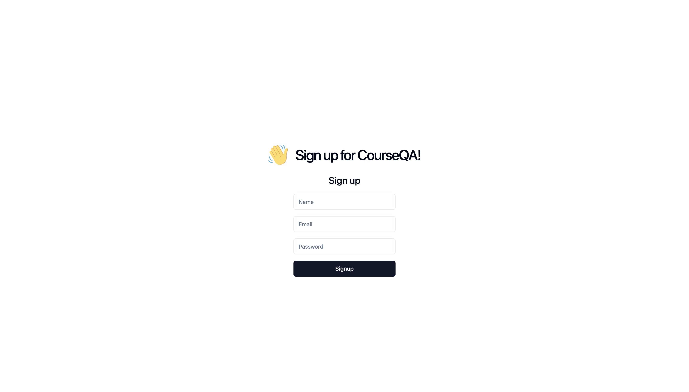
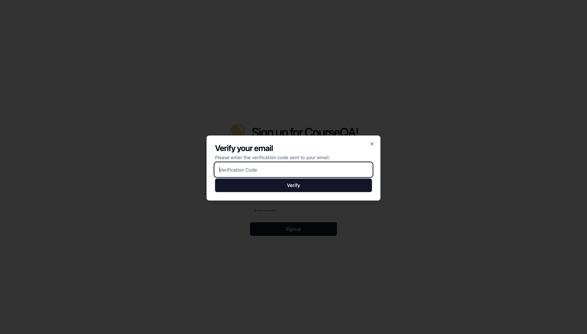
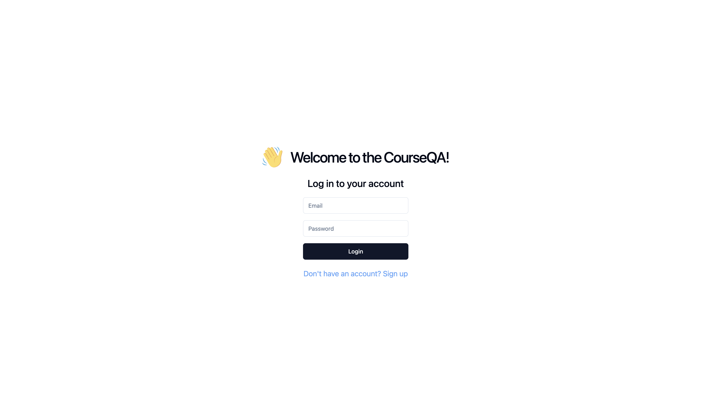

# User Guide
**Before Continuing with this User Guide, please make sure you have deployed the application**
- [Deployment Guides](./DeploymentGuide.md)

| Index                                                                               | Description                                            |
| :-------------------------------------------------- :----------------------------------------------------  |
| [Authentication Page](#authentication-page)                                           | Logging in and signing up                 | [Admin View](#admin-view)                                           | Demonstrates functionalities when logged in as an Admin                 |
| [Instructor View](#instructor-view)                                                     | Demonstrates functionalities when logged in as an Instructor        |
| [Student View](#student-view) | Demonstrates functionalities when logged in as a Student               |

## Authentication Page
**Signup Screen**
The first user who signs up is granted "Admin" privileges. Subsequent users are registered as "Students" to ensure they have the lowest permissions.

Once the user has signed up, they must enter the verification code sent to the registered email.

**Login Screen**
After successfully signing up and verifying their email, the user can login using their credentials.

## Admin View

## Instructor View

## Student View

