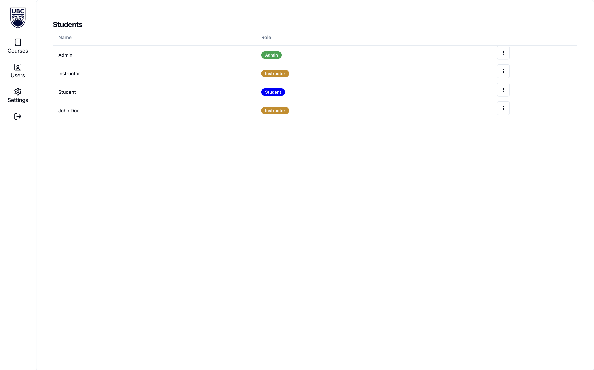
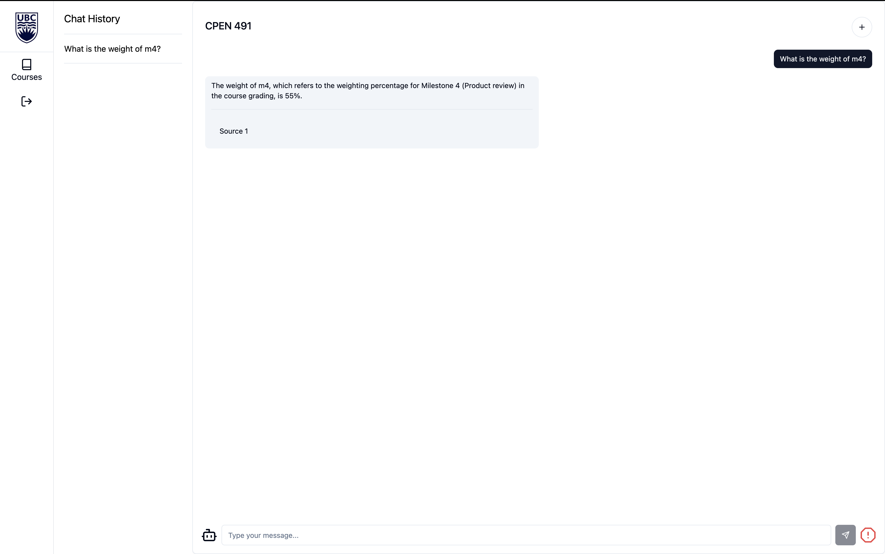
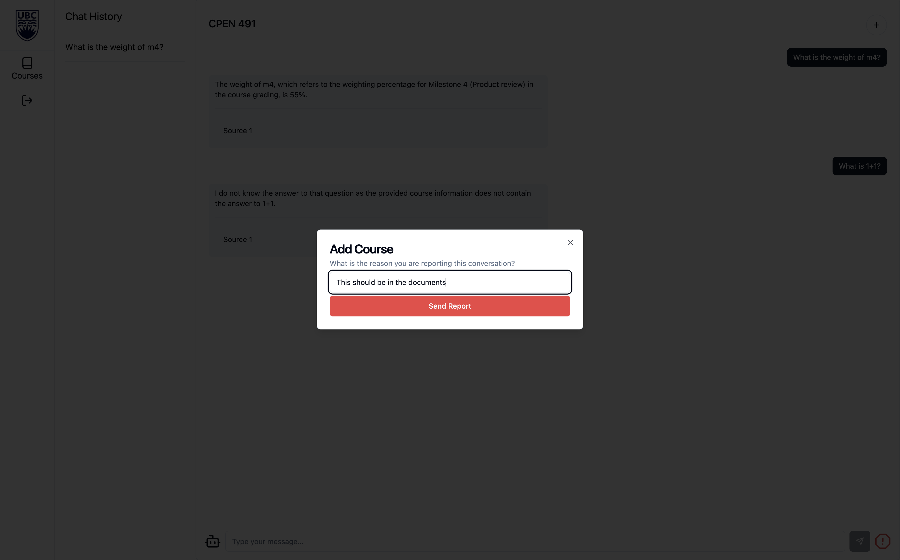

# User Guide
**Before Continuing with this User Guide, please make sure you have deployed the application**
- [Deployment Guides](./DeploymentGuide.md)

| Index                                       | Description                                                               |
| :------------------------------------------ | :---------------------------------------------------------------- |
| [Authentication Page](#authentication-page) | Logging in and signing up                                                |
| [Admin View](#admin-view)                   | Demonstrates functionalities when logged in as an Admin                   |
| [Instructor View](#instructor-view)         | Demonstrates functionalities when logged in as an Instructor              |
| [Student View](#student-view)               | Demonstrates functionalities when logged in as a Student                  |

## Authentication Page
**Signup Screen**

The first user who signs up is granted "Admin" privileges. Subsequent users are registered as "Students" to ensure they have the lowest permissions.

Once the user has signed up, they must enter the verification code sent to the registered email.

**Login Screen**

After successfully signing up and verifying their email, the user can login using their credentials.

## Admin View
**Courses Screen**

Upon signing in with an "Admin" account, the admin can view all the courses offered at the institution.

Clicking on the button in the "Action" column allows the user to edit the selected course.

Clicking on the "Plus" button at the top right corner allows the user to create a new course, and assign an instructor to teach it.

**Institution Users Screen**

After clicking on the "Users" tab on the side navigation bar, the admin can see all of the users that are part of the institution.

The admin can change the role of a user by clicking on the button at the end of the user row and selecting a new role. Users who are initally signed up as students but should be instructors or admins can have their roles elevated here.

## Instructor View
**Courses Screen**
Upon signing in with an "Instructor" account, the instructor can view the courses they are teaching.

Clicking on the "Add Course" button allows the user to create a new course.

## Student View
**Courses Screen**
Upon signing in with a "Student" account, the student can view the courses they are enrolled in.

The user can click on "Join Course" and provide the access code to a course sent by an instructor.

**Chat Screen**
After clicking on the chat button from the courses screen, the student can ask course specific questions to the chat interface. The response returns the source where the information was found.

If the response is not what the student was expecting, they can report the conversation by clicking on the octagon button located at the lower right corner.

